# Workflow Manager

A terminal-based workflow orchestration system for running and monitoring multi-phase AI agent workflows. Built with Rust.



## What is this?

Workflow Manager lets you define, execute, and monitor complex workflows from your terminal. Each workflow runs as its own process and streams structured logs back to the TUI in real-time. You can run multiple workflows in tabs, track phases/tasks/agents hierarchically, and even let Claude execute workflows through the built-in chat interface.

The core idea: workflows are just binaries that follow a simple logging protocol. The TUI discovers them, parses their metadata, and handles all the orchestration.

## Features

- **Tab-based execution** - Run multiple workflows simultaneously, each in its own tab
- **Structured logging** - Hierarchical view of phases, tasks, and agents with real-time updates
- **Workflow discovery** - Auto-discovers workflow binaries and extracts their metadata
- **Claude integration** - Built-in chat interface with MCP tools for AI-driven workflow execution
- **Session persistence** - SQLite-backed history, restore tabs on restart
- **Derive macro** - Define workflows declaratively with `#[derive(WorkflowDefinition)]`

## Project Structure

```
workflow-manager/          # Main TUI application
workflow-manager-sdk/      # SDK for building workflows
workflow-manager-macros/   # Proc macros for #[derive(WorkflowDefinition)]
```

## Installation

```bash
git clone <repo>
cd workflow-manager
cargo build --release
```

The binary will be at `target/release/workflow-manager`.

## Creating a Workflow

Workflows are regular Rust binaries that use the SDK. Here's a minimal example:

```rust
use anyhow::Result;
use clap::Parser;
use workflow_manager_sdk::{WorkflowDefinition, log_phase_start, log_phase_complete};

#[derive(Parser, Debug, Clone, WorkflowDefinition)]
#[workflow(
    id = "my_workflow",
    name = "My Workflow",
    description = "Does something useful"
)]
struct Args {
    #[arg(short, long)]
    #[field(label = "Input", description = "Input file path", type = "file_path")]
    input: String,

    #[arg(long, hide = true)]
    workflow_metadata: bool,
}

#[tokio::main]
async fn main() -> Result<()> {
    let args = Args::parse();

    // Required: handle metadata requests from the TUI
    if args.workflow_metadata {
        args.print_metadata();
        return Ok(());
    }

    // Your workflow logic
    log_phase_start!(0, "Processing", 1);

    // ... do work ...

    log_phase_complete!(0, "Processing");
    Ok(())
}
```

Put the binary in `~/.workflow-manager/workflows/` or the same directory as the TUI binary.

## Logging Protocol

Workflows communicate with the TUI by emitting JSON events to stderr:

```
__WF_EVENT__:{"type":"phase_started","phase":0,"name":"Analyze","total_phases":3}
__WF_EVENT__:{"type":"task_started","phase":0,"task_id":"t1","description":"Parsing input"}
__WF_EVENT__:{"type":"agent_message","task_id":"t1","agent_name":"parser","message":"Found 42 items"}
```

The SDK provides macros so you don't have to build JSON manually:

```rust
use workflow_manager_sdk::*;

log_phase_start!(0, "Analysis", 3);
log_task_start!(0, "parse", "Parsing input files");
log_agent_start!("parse", "claude", "Analyzing content");
log_agent_message!("parse", "claude", "Processing chunk 1/10...");
log_agent_complete!("parse", "claude", "Found 42 items");
log_task_complete!("parse", "Completed successfully");
log_phase_complete!(0, "Analysis");
```

## Keybindings

### Workflow List
| Key | Action |
|-----|--------|
| `j/k` or arrows | Navigate |
| `Enter` or `v` | View workflow details |
| `e` | Edit parameters |
| `l` | Launch in new tab |
| `q` | Quit |

### Tabs View
| Key | Action |
|-----|--------|
| `Tab` / `Shift+Tab` | Switch tabs |
| `Ctrl+T` | New tab |
| `c` or `Ctrl+W` | Close tab |
| `K` | Kill running workflow |
| `r` | Rerun workflow |
| `e` | Edit and rerun |
| `a` | Open chat interface |
| `1` / `2` | Focus structured logs / raw output pane |
| `Space` | Toggle expand all |

### Chat View
| Key | Action |
|-----|--------|
| `Enter` | Send message |
| `Ctrl+Up/Down` | Browse message history |
| `Tab` | Switch panes |
| `Esc` | Back to tabs |

## MCP Tools

When using the chat interface, Claude has access to these tools:

| Tool | Description |
|------|-------------|
| `list_workflows` | List all discovered workflows |
| `execute_workflow` | Run a workflow with parameters |
| `get_workflow_status` | Check execution status |
| `get_workflow_logs` | Retrieve logs from an execution |
| `cancel_workflow` | Stop a running workflow |
| `list_execution_history` | Browse past executions |
| `get_execution_params` | Get params used for an execution |
| `get_workflow_history` | Get previously used parameter values |

## Storage

Data is stored in `~/.workflow-manager/`:

```
~/.workflow-manager/
  executions.db       # SQLite database (executions, logs, params, chat history)
  workflows/          # User-defined workflow binaries
  history.json        # Parameter history for autocomplete
```

## SDK Reference

### Field Types

```rust
#[field(type = "text")]                           // Free text input
#[field(type = "number", min = "1", max = "100")] // Bounded number
#[field(type = "file_path")]                      // File picker with Tab completion
#[field(type = "select", options = "a,b,c")]      // Dropdown selection
#[field(type = "state_file", pattern = "*.json")] // Output from previous phase
```

### Log Events

- `PhaseStarted` / `PhaseCompleted` / `PhaseFailed` - Phase lifecycle
- `TaskStarted` / `TaskProgress` / `TaskCompleted` / `TaskFailed` - Task lifecycle
- `AgentStarted` / `AgentMessage` / `AgentCompleted` / `AgentFailed` - Agent lifecycle
- `StateFileCreated` - Intermediate output files
- `RawOutput` - Captured stdout/stderr

## Building from Source

```bash
# Build everything
cargo build --release

# Run the TUI
cargo run --release -p workflow-manager

# Run a specific workflow binary
cargo run --release --bin simple_echo -- --message "Hello" --repeat 5
```

## Dependencies

- [ratatui](https://github.com/ratatui-org/ratatui) - Terminal UI
- [crossterm](https://github.com/crossterm-rs/crossterm) - Terminal handling
- [tokio](https://tokio.rs) - Async runtime
- [clap](https://github.com/clap-rs/clap) - CLI parsing
- [rusqlite](https://github.com/rusqlite/rusqlite) - SQLite
- [claude-agent-sdk](https://github.com/anthropics/claude-code) - Claude integration

## License

MIT
